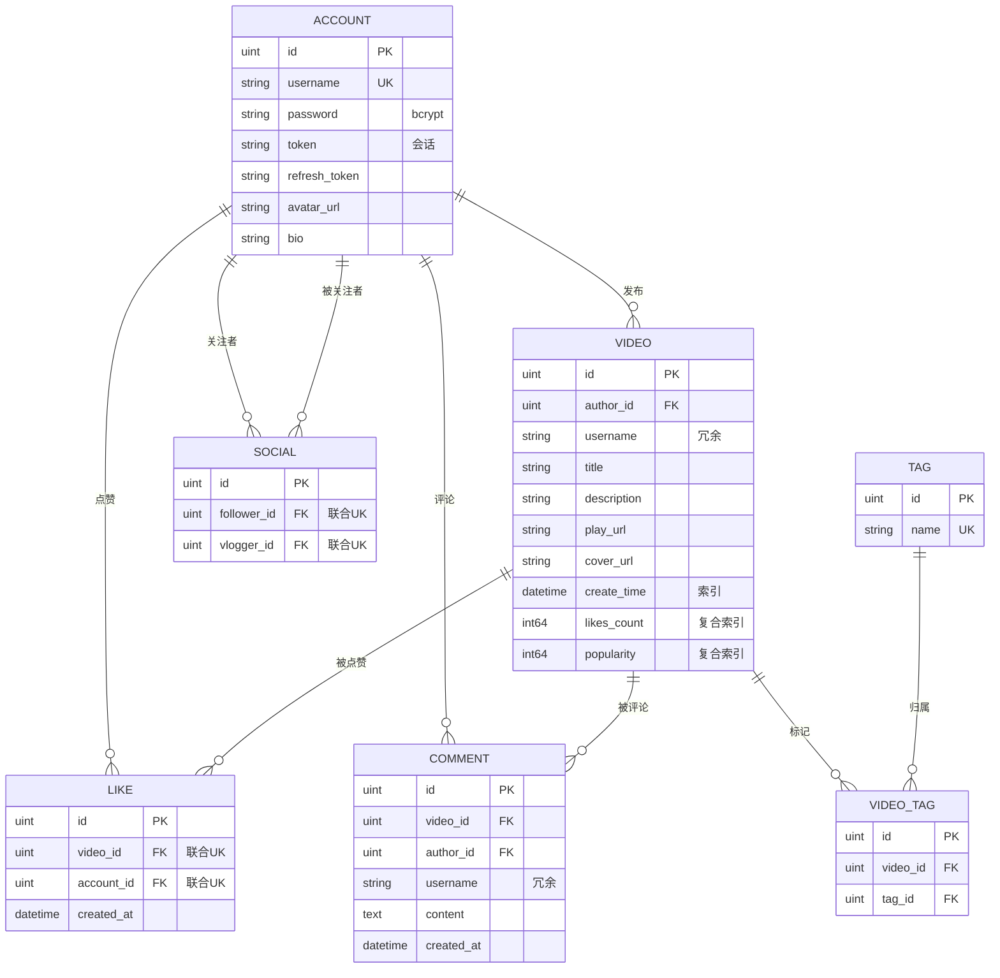

# tiny-feed 架构设计

## 1. 目标
- tiny-feed 后端，掌握 Gin + GORM + MySQL + JWT 的分层架构
- 范围：仅后端，6 大模块（account / video / like / comment / social / feed / profile）

## 2.技术栈

- 语言：Go 1.24
- Web 框架：Gin v1.11
- ORM：GORM v1.31（驱动 gorm.io/driver/mysql）
- 数据库：MySQL 8.0
- 鉴权：JWT（golang-jwt/jwt/v5）+ token 存库实现"登出即失效"
- 配置：yaml + 环境变量覆盖

## 3. 架构
- 模式：单体（Modular Monolith），按业务域拆包
- 分层：handler → service → repo → entity
- 包结构：
  - cmd/                程序入口
  - internal/config/    配置
  - internal/db/        数据库连接
  - internal/http/      路由总入口
  - internal/middleware/jwt/
  - internal/auth/      JWT 签发
  - internal/account/   账号
  - internal/video/     视频/点赞/评论
  - internal/social/    关注
  - internal/feed/      Feed 流
  - internal/profile/   主页聚合
  - internal/apierror/  错误定义

## 4.数据模型

## 5.API清单

### 统一约定（写进文档开头）

| 项             | 约定                                                         |
| :------------- | :----------------------------------------------------------- |
| Base URL       | 本地 `http://localhost:8080`；Docker 走 `http://localhost:8081`（nginx 反代） |
| 请求方式       | **全部 POST + JSON**（除上传是 multipart/form-data）         |
| 鉴权头         | `Authorization: Bearer <token>`                              |
| refresh 专用头 | `X-Refresh-Token: <refresh_token>`                           |
| 错误响应       | 统一 `{"error": "错误信息"}`                                 |
| 状态码映射     | 见下表（`apierror.ClassifyHTTPStatus`）                      |

**错误码映射**（`apierror_errors.go`）：

| 条件                                               | 状态码 |
| :------------------------------------------------- | :----- |
| 参数绑定失败 / ErrValidation                       | 400    |
| 未登录 / token 失效（ErrUnauthorized）             | 401    |
| 非本人操作（ErrForbidden）                         | 403    |
| 资源不存在（ErrNotFound / gorm.ErrRecordNotFound） | 404    |
| 用户名撞名（gorm.ErrDuplicatedKey）                | 409    |
| 其他未识别错误                                     | 500    |

------

### ① 账号 account（公开 7 + 保护 3）

| 接口                           | 鉴权  | 请求体                                   | 成功响应                                                     |
| :----------------------------- | :---- | :--------------------------------------- | :----------------------------------------------------------- |
| POST `/account/register`       | 公开  | `{username, password}`                   | `{id, username}`（撞名 409）                                 |
| POST `/account/login`          | 公开  | `{username, password}`                   | `{token, refresh_token, account_id, username}`（错 401）     |
| POST `/account/changePassword` | 公开* | `{username, old_password, new_password}` | `{status:"ok"}`                                              |
| POST `/account/findByID`       | 公开  | `{id}`                                   | `{id, username, avatar_url?, bio?}`                          |
| POST `/account/findByUsername` | 公开  | `{username}`                             | `{id, username}`                                             |
| POST `/account/getProfile`     | 公开  | `{account_id}`                           | `{account:{id,username,avatar_url?,bio?}, video_count, total_likes, follower_count, vlogger_count}` |
| POST `/account/refresh`        | 公开  | header `X-Refresh-Token`                 | `{token, refresh_token, account_id, username}`               |
| POST `/account/logout`         | 🔒     | 无                                       | `{status:"ok"}`（清库中 token）                              |
| POST `/account/rename`         | 🔒     | `{new_username}`                         | `{status:"ok"}`                                              |
| POST `/account/updateProfile`  | 🔒     | `{avatar_url, bio}`                      | `{status:"ok"}`（只更新非空字段）                            |

> \* changePassword 虽是公开路由，但靠"旧密码正确"完成身份验证——设计意图，不是疏漏。

### ② 视频 video（公开 2 + 保护 4）

| 接口                         | 鉴权 | 请求体                                      | 成功响应                               |
| :--------------------------- | :--- | :------------------------------------------ | :------------------------------------- |
| POST `/video/listByAuthorID` | 公开 | `{author_id}`                               | `{videos:[...]}`                       |
| POST `/video/getDetail`      | 公开 | `{id}`                                      | video 对象（不存在 404）               |
| POST `/video/publish`        | 🔒    | `{title, description, play_url, cover_url}` | video 对象（author 从 JWT 取，防伪造） |
| POST `/video/delete`         | 🔒    | `{id}`                                      | `{status:"ok"}`（非作者 403）          |
| POST `/video/uploadVideo`    | 🔒    | multipart `file` 字段                       | `{url}`（mp4/mov/webm/mkv，≤300MB）    |
| POST `/video/uploadCover`    | 🔒    | multipart `file` 字段                       | `{url}`（jpg/jpeg/png/webp，≤10MB）    |

### ③ 点赞 like（4 个全保护）

| 接口                           | 鉴权 | 请求体       | 成功响应                        |
| :----------------------------- | :--- | :----------- | :------------------------------ |
| POST `/like/like`              | 🔒    | `{video_id}` | `{status:"ok"}`（重复点赞 409） |
| POST `/like/unlike`            | 🔒    | `{video_id}` | `{status:"ok"}`                 |
| POST `/like/isLiked`           | 🔒    | `{video_id}` | `{is_liked: bool}`              |
| POST `/like/listMyLikedVideos` | 🔒    | 无           | `{videos:[...]}`                |

### ④ 评论 comment（公开 1 + 保护 2）

| 接口                    | 鉴权 | 请求体                | 成功响应                      |
| :---------------------- | :--- | :-------------------- | :---------------------------- |
| POST `/comment/listAll` | 公开 | `{video_id}`          | `{comments:[...]}`            |
| POST `/comment/publish` | 🔒    | `{video_id, content}` | comment 对象                  |
| POST `/comment/delete`  | 🔒    | `{comment_id}`        | `{status:"ok"}`（非作者 403） |

### ⑤ 关注 social（公开 2 + 保护 3）

| 接口                           | 鉴权 | 请求体          | 成功响应                                      |
| :----------------------------- | :--- | :-------------- | :-------------------------------------------- |
| POST `/social/getAllFollowers` | 公开 | `{vlogger_id}`  | `{followers:[...], follower_count}`           |
| POST `/social/getAllVloggers`  | 公开 | `{follower_id}` | `{vloggers:[...], vlogger_count}`             |
| POST `/social/follow`          | 🔒    | `{vlogger_id}`  | `{status:"ok"}`（follower 从 JWT 取）         |
| POST `/social/unfollow`        | 🔒    | `{vlogger_id}`  | `{status:"ok"}`                               |
| POST `/social/getCounts`       | 🔒    | 无              | `{follower_count, vlogger_count}`（当前用户） |

### ⑥ Feed 流（公开可选登录 3 + 保护 2）

| 接口                          | 鉴权  | 请求体                                                       | 成功响应                                                     |
| :---------------------------- | :---- | :----------------------------------------------------------- | :----------------------------------------------------------- |
| POST `/feed/listLatest`       | 公开* | `{limit, latest_time}`                                       | `{video_list, next_time, has_more}`                          |
| POST `/feed/listLikesCount`   | 公开* | `{limit, likes_count_before?, id_before?}`                   | `{video_list, next_likes_count_before?, next_id_before?, has_more}` |
| POST `/feed/listByTag`        | 公开* | `{tag, limit}`                                               | `{video_list}`                                               |
| POST `/feed/listByFollowing`  | 🔒     | `{limit, latest_time}`                                       | `{video_list, next_time, has_more}`                          |
| POST `/feed/listByPopularity` | 🔒     | `{limit, as_of, offset, latest_id_before?, latest_popularity, latest_before}` | `{video_list, as_of, next_offset, has_more, next_latest_*?}` |

> \* 公开但**可选登录**：带了 token 则 `is_liked` 真实填充，未登录全为 `false`。这是 feed handler 里 `currentAccountID()` 的巧妙设计。

**FeedVideoItem 统一结构**：`{id, author:{id, username, avatar_url?}, title, description?, play_url, cover_url, create_time, likes_count, is_liked}`

### ⑦ 其他（2 个）

| 接口                    | 说明                                                |
| :---------------------- | :-------------------------------------------------- |
| GET `/healthz`          | `{"status":"ok"}`，**不依赖 MySQL**，负载均衡探活用 |
| GET `/static/*filepath` | 上传的视频/封面静态文件                             |
